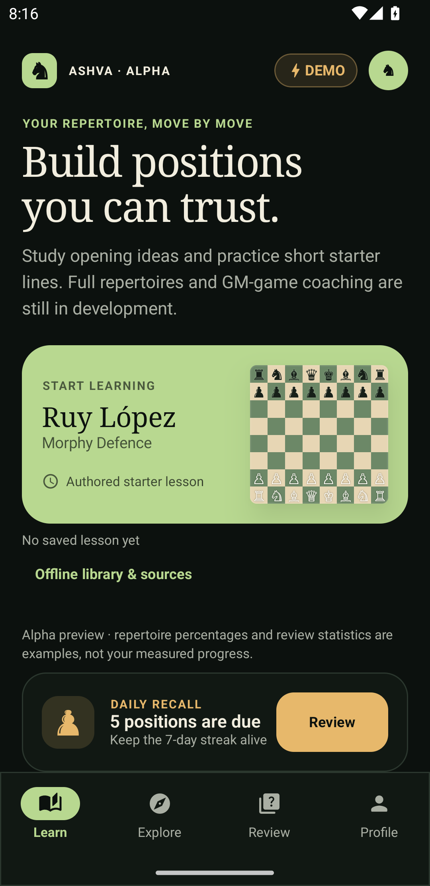
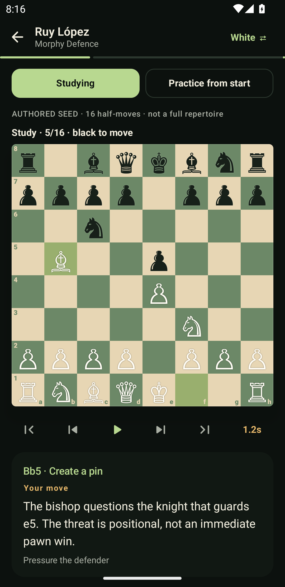
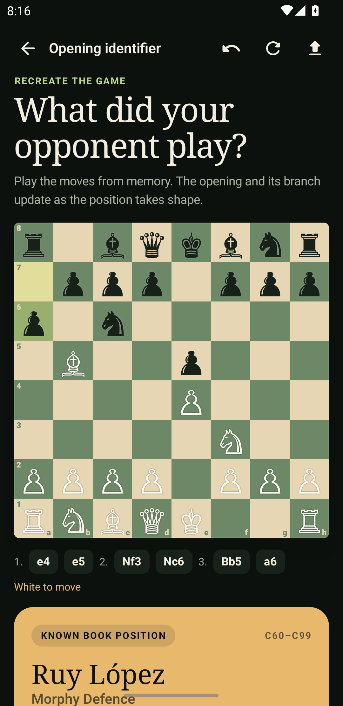

# Ashva ♞

An Android-first chess repertoire teacher built with native Jetpack Compose and Kotlin Multiplatform. Ashva (अश्व, “horse”) takes its name from the chess knight.

**Early alpha · Android 0.17.0.** An offline opening-course and original-game teacher, not an exhaustive opening book or independently expert-reviewed curriculum. No Play Store release or playable iOS client exists. Game browsing, per-move coaching and separate analyzed branches are verified; the broader roadmap remains unfinished.

| Learn                                             | Study a line                                                | Identify                                                                  |
| ------------------------------------------------- | ----------------------------------------------------------- | ------------------------------------------------------------------------- |
|  |  |  |

Screenshots are from the Android 0.3.1 alpha on an isolated API 33 emulator, using synthetic starter-lesson state. Any demo percentages are explicitly labeled.

## What you can try

- **New in 0.17 — full Ruy Lopez deep course:** both colours, 10 chapters (Berlin, Exchange, Open, Closed main systems, Marshall/Anti-Marshall, other Morphy systems, Schliemann, Classical, old Steinitz, other third moves) plus an annotated GM game (*Firouzja–Carlsen, Tata Steel 2020*). 898 lines and 11,190 positions from master (2200+) and club games, every line played to an engine verdict or a transposition. Variations carry their real names, important unnamed GM lines are included, and each variation shows how White and Black win it: rating-band statistics, written plans checked against the winners' moves, and replayable example games. Course text is generated and shown only when its claims pass automatic engine/statistics/board checks. See [the deep course plan](docs/DEEP_COURSE_PLAN.md) and [testing steps](docs/USER_TESTING.md#test-the-full-ruy-lopez-course-017).
- Study and practice all 149 catalog families as White or Black, with rules-derived move explanations and original Ashva plans. The main Learn/Explore flow opens courses, not just starter demos.
- See the Full idea, plans and complete move list; replay, jump, pause and change speed.
- Expand **Understand this position** during study for both-color pawn structures/break candidates, threats, tactical geometry and conditional middlegame/endgame plans. Board facts, original plans and engine output stay distinct.
- Choose a named variation and return to its exact branch point.
- Get the next-move hint automatically after an incorrect attempt. Legal off-line moves are not automatically blunders; the board stays unchanged until a correct move or confirmed switch.
- Search all 3,815 named source routes plus 78 authored study continuations in 47 families. The bundled opening pack installs locally on first launch; no internet or account is required. Raw source lessons remain under Sourced; original demos remain under Starter.
- Build a family-scoped repertoire for either color: choose preferred moves, include opponent replies, inspect unanswered branches, and practice only recorded routes fitting those choices. Find saved choices under **My repertoires**; earlier revisions remain available for bookmarked lessons.
- Save named multi-opening repertoires for either color, with exact family revisions and an interleaved practice queue. Check shared-position conflicts and unavailable members before practice; explicitly edit membership to adopt newer revisions. No choices are silently overwritten or unsupported move orders stitched together.
- See original-move counts from installed broadcasts at the editor's current position, including replies outside your family snapshot. January 2020 adds 857 accepted scores to the retained 79-score April fixture; both together supply 936 score records. Exact sources, rejected-record counts and first-visit rules are visible—not representative master popularity, engine rankings or win odds.
- Identify positions using the starter book plus installed source endpoints, including transpositions and explicit ambiguous/unknown/last-known results.
- Paste standard PGN/FEN into the identifier; imports currently open the final position, not the guided game player.
- Browse/search/filter installed full scores under **Players & GM games**, explicitly follow players, import a private PGN and replay original games from either color with exact-source cold bookmarks. Each move has a checked board-change explanation and conditional principle; user commentary and reported identities/titles remain unverified.
- Compare the next recorded move with bounded offline engine candidates, explore a clearly hypothetical continuation and return to the unchanged original game. Explanations and engine-score perspective work from either POV; previews never rewrite the score/result or prove mastery.
- Resume a saved lesson after cold relaunch, preserving color, cursor, branch history and hint context.
- Android0.15 adds actual chosen-scope recall: practice a route, a saved family policy or a pinned multi-opening set to enroll its learner decisions; Review asks one due position at a time. Profile separates unaided/assisted/unsuccessful answers, Study views and retained ungraded history. Wait for saved status; temporary failed saves have an explicit, idempotent retry.
- Install the three reviewed, bundled source packs into local Room/SQLite without internet or an account.
- Analyze alternatives offline with a separate Stockfish 19 engine, compare the lesson/attempted move and replay hypothetical continuations without changing the lesson.

## Coverage: lessons are different from source data

| Content               | Delivered                     | Limits                                                                                                |
| --------------------- | ----------------------------- | ----------------------------------------------------------------------------------------------------- |
| Opening courses       | 149 families / 3,893 routes   | 3,815 source routes plus 78 authored continuations (15–33 half-moves) in 47 families; conditional Ashva plans and board-derived facts, not independently reviewed theory |
| Opening taxonomy pack | 3,815 sequences / 3,174 names | Immutable CC0 routes, 1–36 half-moves; raw source presentation remains separate from Ashva guidance |
| Legacy starter demos  | 7 openings / 13 short lines   | Retained under Starter and for existing bookmarks/policies, not the default course catalog |
| Broadcast packs       | 857 January + 79 April 2020 accepted scores | 82,679 half-moves, browsable/replayable in Players & GM games; January attempts952 inputs/quarantines95. Not complete careers, authenticated identities or representative master popularity |

The main Ruy Lopez course has 235 named source routes plus 9 study continuations; Sicilian has 391 plus 7, London System 4 plus 4, French 212 plus 5, and Caro-Kann 110 plus 4. All families have move explanations and both-color positional guidance; uncommon families explicitly use general guidance, not claimed specialist theory. Authored study continuations are illustrative, not historical scores or engine-certified best lines. In the trainer, **Build / edit my repertoire** saves preferred moves and included replies separately from the broad course explorer. Individual policies remain family/color/snapshot-bound; existing seed/source policies and bookmarks retain their original identities and content. My repertoires also supports named, revision-pinned multi-family practice queues. Android0.15 replaces demo Review/Profile/Home progress with actual chosen-scope decisions and an original deterministic spaced schedule. Hints, successful exposed analysis and recent Study count as assistance, not unaided recall. Established means three separated due successes and not overdue; it is not a chess rating or empirically calibrated mastery. See [recall identities, intervals and limits](docs/RECALL_REVIEW.md).

Offline Stockfish supplies bounded candidates; Ashva explains their checked board changes and offers position-specific conditional ideas, not independent strategic certification or historical intent. Original-game coaching and optional local service validation are implemented;0.15 recall is undergoing its final full regression gates. Board/device quality, cloud sync/deployment and a playable iOS client remain separate work. iOS implementation is owner-deferred while Android is completed. No finite database covers every possible continuation or guarantees wins. See [game coaching](docs/HISTORICAL_GAME_COACH.md), [grounded teaching](docs/GROUNDED_TEACHING.md) and [engine provenance/limits](docs/ENGINE_ANALYSIS.md).

See [delivered coverage](docs/OPENING_COVERAGE.md), [game library](docs/GM_LIBRARY.md), [content provenance](docs/CONTENT_PIPELINE.md), [offline storage](docs/OFFLINE_STORAGE.md) and [learning design](docs/LEARNING_DESIGN.md).

## Build and run

Install Android Studio/SDK (platform 37, build tools 37.0.0), NDK 30.0.16248370, JDK 21 and Node 22. Java/Kotlin bytecode targets 17. Engine preparation supports macOS/Linux; macOS with Xcode also supports shared iOS compilation. Set `ANDROID_HOME` to your SDK or configure an ignored `local.properties`; do not commit machine-specific paths.

From the project root:

```bash
export ASHVA_NDK_DIR="$ANDROID_HOME/ndk/30.0.16248370"
node scripts/prepare-stockfish.mjs
./gradlew :androidApp:assembleDebug
adb devices -l
adb -s <your-device-serial> install -r androidApp/build/outputs/apk/debug/androidApp-debug.apk
adb -s <your-device-serial> shell am start -W -n com.openinglab.app/.MainActivity
```

Replace the serial placeholder with the exact device shown by adb. The launcher name is **Ashva**; the existing `com.openinglab.app` package and database name are retained to preserve upgrades and learner data. Do not uninstall or clear app data to update.

[Step-by-step user testing](docs/USER_TESTING.md) covers phone installation, emulator setup, both colors, hints, branch replay, offline packs and cold resume.

## Stack and architecture

Native Compose UI only—no XML screens, Views, Fragments or WebView board. XML is limited to Android platform resources, including launcher/theme/backup policy.

- Kotlin 2.4.20 / AGP 9.4.1 / Gradle 9.7.1.
- Compose BOM 2026.09.00 / Material 3 / Navigation 3 1.1.7 / Lifecycle 2.11.0.
- API 37, minimum Android 8.0 (API 26).
- Room KMP 2.8.5 / SQLite 2.7.1 / KSP 2.3.12 / coroutines 1.11.0.
- Serialization 1.11.0; shared Android, JVM and iOS compilation targets.

Versions are centrally pinned in [the version catalog](gradle/libs.versions.toml), not a claim that every dependency is always the newest. Upgrades use official stable releases, compatibility checks and tests; experimental channels need an explicit decision.

`androidApp` owns Compose rendering, Navigation 3 and lifecycle-aware immutable UI state. `shared` owns legal rules, notation/PGN, position identity, lesson graphs/replay and Room repository contracts. `contentTools` imports reviewed data locally using those same rules. Analysis/import work stays off the UI thread.

Optional `contentService` provides local Ktor/PostgreSQL search, source-attributed versioned pack downloads/deltas and a bounded durable analysis/import queue. It is not deployed or connected to Android; no learner uploads, new providers or accounts are enabled. See [local service setup, API and checks](docs/CONTENT_SERVICE.md).

## Checks

```bash
node --test scripts/*.test.mjs
node scripts/public-audit.mjs
node scripts/run-secret-scan.mjs
./gradlew :shared:jvmTest :shared:testAndroidHostTest :contentTools:test
./gradlew :contentService:test
# Opt-in local Docker/host-UCI service checks, after reviewed engine preparation:
node scripts/prepare-service-engine.mjs
node scripts/test-content-service.mjs
./gradlew :contentTools:run --args=verify
./gradlew :androidApp:assembleDebug :androidApp:assembleRelease :androidApp:lintDebug
# Only on a separate test device; connected tests can uninstall target data.
ANDROID_SERIAL=<isolated-test-serial> ./gradlew :androidApp:connectedDebugAndroidTest
# On macOS:
./gradlew :shared:compileKotlinIosSimulatorArm64 :shared:compileKotlinIosArm64
```

The scanner downloads a checksum-pinned official Gitleaks binary into a temporary directory, prints no matched values, and removes only its own temporary directory. Automatic download supports Apple Silicon macOS and Linux x64; other platforms can run Gitleaks 8.30.1 manually with `.gitleaks.toml`. It scans directories, not Git history. Neither audit is a guarantee that no vulnerability or secret exists.

[CI](.github/workflows/ci.yml) runs build, domain/importer tests, pack verification, lint, secret/privacy checks, isolated Compose tests and shared iOS compilation. Actions are immutable-pinned with read-only repository permissions; no publishing, signing, cloud deployment or paid service is configured. Hosted CI remains unverified until the owner pushes and sees it pass. Its read-only Relay project-memory check uses `node scripts/check-relay-context.mjs` without requiring a locally installed skill; agents still follow AGENTS.md and the local Relay claim/doctor protocol.

## Contribute, privacy and licensing

Read [CONTRIBUTING](CONTRIBUTING.md), [SECURITY](SECURITY.md), [privacy](docs/PRIVACY.md) and [public-readiness notes](docs/PUBLIC_READINESS.md). Reports should use synthetic games and redact device logs.

Original Ashva code and project-authored documentation/assets are licensed under [Apache-2.0](LICENSE), Copyright 2026 Shishir Jha. See [NOTICE](NOTICE) for attribution and [license scope](LICENSES/README.md) for exclusions. This does not relicense chess data or third-party components. Opening taxonomy is CC0-1.0; broadcast exports and derived game data are CC-BY-SA-4.0. Keep source URLs, revisions, changes and attribution with redistributed data. See [third-party notices](THIRD_PARTY_NOTICES.md) and each immutable pack's manifest/ATTRIBUTION.txt.

Ashva is independent of Lichess, Chess.com and the people named in historical data; no endorsement is implied.
